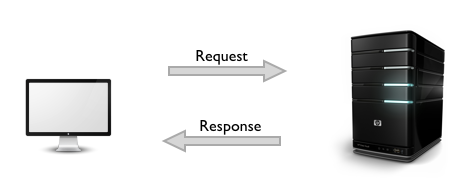

Метод GET
================

Два підходи до web content mining
---------------------------------

### Робота з REST API (1 модуль)

Перший підхід полягає в безпосередній взаємодії з базою веб-ресурсу через http-запити: 

### Scraping (2 модуль)

Другий підхід складніший - ми самі відтворюємо базу через трансльований веб-контент: 

Вступ до роботи з API
---------------------

HTTP - протокол передачі гіпертексту. Це протокол для бездротових додатків для комунікації між розподіленими системами та є основою сучасної мережі.

HTTP дозволяє спілкуватися між різними хостами та клієнтами та підтримує суміш конфігурацій мережі.

Для того, щоб зробити це можливим, він припускає дуже мало про конкретну систему і не підтримує стан між різними обмінами повідомлень.

Це робить протокол HTTP незалежним. Зв'язок зазвичай проходить через TCP / IP, але можна використовувати будь-який надійний транспорт. Стандартний порт для TCP / IP - 80, але інші порти також можуть бути використані.

Користувальницькі заголовки також можуть бути створені та надіслані клієнтом.

Зв'язок між хостом і клієнтом відбувається через пару запитів / відповідей. Клієнт ініціює повідомлення про HTTP запит, який обслуговується через відповідне повідомлення HTTP.



В основі веб-комунікацій належить повідомлення про запрошення, яке надсилається через уніфіковані локатори ресурсів (URL-адреси). Я впевнений, що ви вже знайомі з URL-адресами, але для повноти я додам його тут. URL-адреси мають просту структуру, яка складається з наступних компонентів:


Протокол, як правило, http, але для безпечної комунікації він також може бути https. Стандартний порт складає 80, але його можна однозначно встановити, як це показано на наведеному вище зображенні. Шлях ресурсу - локальний шлях до ресурсу на сервері.

Основні типи http-запитів
-------------------------

-   **GET:** завантажте існуючий ресурс. URL містить всю необхідну інформацію, яку сервер повинен знайти та повернути ресурс.
-   **POST:** створити новий ресурс. Запити POST зазвичай містять корисну інформацію, яка вказує дані для нового ресурсу.
-   **PUT:** оновити існуючий ресурс. Корисна інформація може містити оновлені дані ресурсу.
-   **DELETE:** видалити існуючий ресурс.

Необхідні бібліотеки
--------------------

В R бібліотеки встановлюються командою `install.packages("package_name")`. Викликати бібліотеку можна функцією `library`. Аналоги - `require`, `package_name::function`.

У цьому кейсі ми використаємо 3 бібліотеки (синонім - пакети):

-   httr - бібліотека для виклику методів роботи з методами http (GET, POST)
-   jsonlite - бібліотека для обробки json файлів
-   magrittr - бібліотека, яка підключає функцію `%>%`

``` r
library(httr)
```

    ## Warning: package 'httr' was built under R version 3.3.2

``` r
library(jsonlite)
```

    ## Warning: package 'jsonlite' was built under R version 3.3.2

``` r
library(magrittr)
```

Робота зі Star Wars API
-----------------------

Завдання: викачати базу сайту Зоряних війн. Метод роботи: GET URL: <http://swapi.co/api/people/> Параметр: search

Два способи зробити запит:

Подивимось на структуру отриманого файлу:

``` r
str(vader)
```

    ## List of 10
    ##  $ url        : chr "http://swapi.co/api/people/?search=vader"
    ##  $ status_code: int 200
    ##  $ headers    :List of 13
    ##   ..$ date             : chr "Mon, 18 Sep 2017 12:05:16 GMT"
    ##   ..$ content-type     : chr "application/json"
    ##   ..$ transfer-encoding: chr "chunked"
    ##   ..$ connection       : chr "keep-alive"
    ##   ..$ set-cookie       : chr "__cfduid=df4eefe59630e121773fcfe527cef49021505736312; expires=Tue, 18-Sep-18 12:05:12 GMT; path=/; domain=.swapi.co; HttpOnly"
    ##   ..$ etag             : chr "W/\"aeb3c302f6866c5a0a548eaafa967d61\""
    ##   ..$ allow            : chr "GET, HEAD, OPTIONS"
    ##   ..$ x-frame-options  : chr "SAMEORIGIN"
    ##   ..$ vary             : chr "Accept, Cookie"
    ##   ..$ via              : chr "1.1 vegur"
    ##   ..$ server           : chr "cloudflare-nginx"
    ##   ..$ cf-ray           : chr "3a042c0ee1a88406-KBP"
    ##   ..$ content-encoding : chr "gzip"
    ##   ..- attr(*, "class")= chr [1:2] "insensitive" "list"
    ##  $ all_headers:List of 1
    ##   ..$ :List of 3
    ##   .. ..$ status : int 200
    ##   .. ..$ version: chr "HTTP/1.1"
    ##   .. ..$ headers:List of 13
    ##   .. .. ..$ date             : chr "Mon, 18 Sep 2017 12:05:16 GMT"
    ##   .. .. ..$ content-type     : chr "application/json"
    ##   .. .. ..$ transfer-encoding: chr "chunked"
    ##   .. .. ..$ connection       : chr "keep-alive"
    ##   .. .. ..$ set-cookie       : chr "__cfduid=df4eefe59630e121773fcfe527cef49021505736312; expires=Tue, 18-Sep-18 12:05:12 GMT; path=/; domain=.swapi.co; HttpOnly"
    ##   .. .. ..$ etag             : chr "W/\"aeb3c302f6866c5a0a548eaafa967d61\""
    ##   .. .. ..$ allow            : chr "GET, HEAD, OPTIONS"
    ##   .. .. ..$ x-frame-options  : chr "SAMEORIGIN"
    ##   .. .. ..$ vary             : chr "Accept, Cookie"
    ##   .. .. ..$ via              : chr "1.1 vegur"
    ##   .. .. ..$ server           : chr "cloudflare-nginx"
    ##   .. .. ..$ cf-ray           : chr "3a042c0ee1a88406-KBP"
    ##   .. .. ..$ content-encoding : chr "gzip"
    ##   .. .. ..- attr(*, "class")= chr [1:2] "insensitive" "list"
    ##  $ cookies    :'data.frame': 1 obs. of  7 variables:
    ##   ..$ domain    : chr "#HttpOnly_.swapi.co"
    ##   ..$ flag      : logi TRUE
    ##   ..$ path      : chr "/"
    ##   ..$ secure    : logi FALSE
    ##   ..$ expiration: POSIXct[1:1], format: "2018-09-18 15:05:12"
    ##   ..$ name      : chr "__cfduid"
    ##   ..$ value     : chr "df4eefe59630e121773fcfe527cef49021505736312"
    ##  $ content    : raw [1:608] 7b 22 63 6f ...
    ##  $ date       : POSIXct[1:1], format: "2017-09-18 12:05:16"
    ##  $ times      : Named num [1:6] 0 0.00509 0.03079 0.03098 4.73928 ...
    ##   ..- attr(*, "names")= chr [1:6] "redirect" "namelookup" "connect" "pretransfer" ...
    ##  $ request    :List of 7
    ##   ..$ method    : chr "GET"
    ##   ..$ url       : chr "http://swapi.co/api/people/?search=vader"
    ##   ..$ headers   : Named chr "application/json, text/xml, application/xml, */*"
    ##   .. ..- attr(*, "names")= chr "Accept"
    ##   ..$ fields    : NULL
    ##   ..$ options   :List of 2
    ##   .. ..$ useragent: chr "libcurl/7.54.0 r-curl/2.8.1 httr/1.3.1"
    ##   .. ..$ httpget  : logi TRUE
    ##   ..$ auth_token: NULL
    ##   ..$ output    : list()
    ##   .. ..- attr(*, "class")= chr [1:2] "write_memory" "write_function"
    ##   ..- attr(*, "class")= chr "request"
    ##  $ handle     :Class 'curl_handle' <externalptr> 
    ##  - attr(*, "class")= chr "response"

А тепер поглянемо на контент:

``` r
vader$content
```

    ##   [1] 7b 22 63 6f 75 6e 74 22 3a 31 2c 22 6e 65 78 74 22 3a 6e 75 6c 6c 2c
    ##  [24] 22 70 72 65 76 69 6f 75 73 22 3a 6e 75 6c 6c 2c 22 72 65 73 75 6c 74
    ##  [47] 73 22 3a 5b 7b 22 6e 61 6d 65 22 3a 22 44 61 72 74 68 20 56 61 64 65
    ##  [70] 72 22 2c 22 68 65 69 67 68 74 22 3a 22 32 30 32 22 2c 22 6d 61 73 73
    ##  [93] 22 3a 22 31 33 36 22 2c 22 68 61 69 72 5f 63 6f 6c 6f 72 22 3a 22 6e
    ## [116] 6f 6e 65 22 2c 22 73 6b 69 6e 5f 63 6f 6c 6f 72 22 3a 22 77 68 69 74
    ## [139] 65 22 2c 22 65 79 65 5f 63 6f 6c 6f 72 22 3a 22 79 65 6c 6c 6f 77 22
    ## [162] 2c 22 62 69 72 74 68 5f 79 65 61 72 22 3a 22 34 31 2e 39 42 42 59 22
    ## [185] 2c 22 67 65 6e 64 65 72 22 3a 22 6d 61 6c 65 22 2c 22 68 6f 6d 65 77
    ## [208] 6f 72 6c 64 22 3a 22 68 74 74 70 3a 2f 2f 73 77 61 70 69 2e 63 6f 2f
    ## [231] 61 70 69 2f 70 6c 61 6e 65 74 73 2f 31 2f 22 2c 22 66 69 6c 6d 73 22
    ## [254] 3a 5b 22 68 74 74 70 3a 2f 2f 73 77 61 70 69 2e 63 6f 2f 61 70 69 2f
    ## [277] 66 69 6c 6d 73 2f 32 2f 22 2c 22 68 74 74 70 3a 2f 2f 73 77 61 70 69
    ## [300] 2e 63 6f 2f 61 70 69 2f 66 69 6c 6d 73 2f 36 2f 22 2c 22 68 74 74 70
    ## [323] 3a 2f 2f 73 77 61 70 69 2e 63 6f 2f 61 70 69 2f 66 69 6c 6d 73 2f 33
    ## [346] 2f 22 2c 22 68 74 74 70 3a 2f 2f 73 77 61 70 69 2e 63 6f 2f 61 70 69
    ## [369] 2f 66 69 6c 6d 73 2f 31 2f 22 5d 2c 22 73 70 65 63 69 65 73 22 3a 5b
    ## [392] 22 68 74 74 70 3a 2f 2f 73 77 61 70 69 2e 63 6f 2f 61 70 69 2f 73 70
    ## [415] 65 63 69 65 73 2f 31 2f 22 5d 2c 22 76 65 68 69 63 6c 65 73 22 3a 5b
    ## [438] 5d 2c 22 73 74 61 72 73 68 69 70 73 22 3a 5b 22 68 74 74 70 3a 2f 2f
    ## [461] 73 77 61 70 69 2e 63 6f 2f 61 70 69 2f 73 74 61 72 73 68 69 70 73 2f
    ## [484] 31 33 2f 22 5d 2c 22 63 72 65 61 74 65 64 22 3a 22 32 30 31 34 2d 31
    ## [507] 32 2d 31 30 54 31 35 3a 31 38 3a 32 30 2e 37 30 34 30 30 30 5a 22 2c
    ## [530] 22 65 64 69 74 65 64 22 3a 22 32 30 31 34 2d 31 32 2d 32 30 54 32 31
    ## [553] 3a 31 37 3a 35 30 2e 33 31 33 30 30 30 5a 22 2c 22 75 72 6c 22 3a 22
    ## [576] 68 74 74 70 3a 2f 2f 73 77 61 70 69 2e 63 6f 2f 61 70 69 2f 70 65 6f
    ## [599] 70 6c 65 2f 34 2f 22 7d 5d 7d

Навряд чи тут можна щось проаналізувати. Нічого страшного - це формат даних raw.

Вікіпедія дуже зрозуміло його характеризує:

> RAW (англ. raw — сирий) — формат даних, що містить необроблені (або мінімально оброблені) дані, що дозволяє уникнути втрат інформації, і не має чіткої специфікації. У таких файлах міститься повна інформація про збережений сигнал. Вихідні файли зображень (RAW) іноді називають цифровими негативами, вони виконують ту ж роль, що й негативи в плівковій фотографії: тобто, негатив не являє собою безпосередньо зображення, але має всю необхідну інформацію для створення зображення. Крім того, процес перетворення сирих файлів зображень в зрозумілому форматі іноді називають обробкою необробленого зображення, за аналогією з процесом проявлення плівки (використовуються для перетворення фотоплівки у видимі відбитки).

``` r
vader$status_code
```

    ## [1] 200

``` r
vader$headers$`content-type`
```

    ## [1] "application/json"

``` r
names(vader)
```

    ##  [1] "url"         "status_code" "headers"     "all_headers" "cookies"    
    ##  [6] "content"     "date"        "times"       "request"     "handle"

Тепер настав час отримати дані у форматі, доступному для сприйняття людиною.

``` r
text_content <- content(vader, as = "text", encoding = "UTF-8")
text_content
```

    ## [1] "{\"count\":1,\"next\":null,\"previous\":null,\"results\":[{\"name\":\"Darth Vader\",\"height\":\"202\",\"mass\":\"136\",\"hair_color\":\"none\",\"skin_color\":\"white\",\"eye_color\":\"yellow\",\"birth_year\":\"41.9BBY\",\"gender\":\"male\",\"homeworld\":\"http://swapi.co/api/planets/1/\",\"films\":[\"http://swapi.co/api/films/2/\",\"http://swapi.co/api/films/6/\",\"http://swapi.co/api/films/3/\",\"http://swapi.co/api/films/1/\"],\"species\":[\"http://swapi.co/api/species/1/\"],\"vehicles\":[],\"starships\":[\"http://swapi.co/api/starships/13/\"],\"created\":\"2014-12-10T15:18:20.704000Z\",\"edited\":\"2014-12-20T21:17:50.313000Z\",\"url\":\"http://swapi.co/api/people/4/\"}]}"

Два способи перетворення json файлу

``` r
parsed_content <- content(vader, as = "parsed")
names(parsed_content)
```

    ## [1] "count"    "next"     "previous" "results"

``` r
parsed_content$count
```

    ## [1] 1

``` r
str(parsed_content$results)
```

    ## List of 1
    ##  $ :List of 16
    ##   ..$ name      : chr "Darth Vader"
    ##   ..$ height    : chr "202"
    ##   ..$ mass      : chr "136"
    ##   ..$ hair_color: chr "none"
    ##   ..$ skin_color: chr "white"
    ##   ..$ eye_color : chr "yellow"
    ##   ..$ birth_year: chr "41.9BBY"
    ##   ..$ gender    : chr "male"
    ##   ..$ homeworld : chr "http://swapi.co/api/planets/1/"
    ##   ..$ films     :List of 4
    ##   .. ..$ : chr "http://swapi.co/api/films/2/"
    ##   .. ..$ : chr "http://swapi.co/api/films/6/"
    ##   .. ..$ : chr "http://swapi.co/api/films/3/"
    ##   .. ..$ : chr "http://swapi.co/api/films/1/"
    ##   ..$ species   :List of 1
    ##   .. ..$ : chr "http://swapi.co/api/species/1/"
    ##   ..$ vehicles  : list()
    ##   ..$ starships :List of 1
    ##   .. ..$ : chr "http://swapi.co/api/starships/13/"
    ##   ..$ created   : chr "2014-12-10T15:18:20.704000Z"
    ##   ..$ edited    : chr "2014-12-20T21:17:50.313000Z"
    ##   ..$ url       : chr "http://swapi.co/api/people/4/"

``` r
parsed_content$results[[1]]$name
```

    ## [1] "Darth Vader"

``` r
parsed_content$results[[1]]$terrain
```

    ## NULL

``` r
json_content <- text_content %>% fromJSON
json_content
```

    ## $count
    ## [1] 1
    ## 
    ## $`next`
    ## NULL
    ## 
    ## $previous
    ## NULL
    ## 
    ## $results
    ##          name height mass hair_color skin_color eye_color birth_year
    ## 1 Darth Vader    202  136       none      white    yellow    41.9BBY
    ##   gender                      homeworld
    ## 1   male http://swapi.co/api/planets/1/
    ##                                                                                                                    films
    ## 1 http://swapi.co/api/films/2/, http://swapi.co/api/films/6/, http://swapi.co/api/films/3/, http://swapi.co/api/films/1/
    ##                          species vehicles
    ## 1 http://swapi.co/api/species/1/     NULL
    ##                           starships                     created
    ## 1 http://swapi.co/api/starships/13/ 2014-12-10T15:18:20.704000Z
    ##                        edited                           url
    ## 1 2014-12-20T21:17:50.313000Z http://swapi.co/api/people/4/

``` r
planetary_data <- json_content$results
names(planetary_data)
```

    ##  [1] "name"       "height"     "mass"       "hair_color" "skin_color"
    ##  [6] "eye_color"  "birth_year" "gender"     "homeworld"  "films"     
    ## [11] "species"    "vehicles"   "starships"  "created"    "edited"    
    ## [16] "url"

``` r
planetary_data$name
```

    ## [1] "Darth Vader"

``` r
planetary_data$terrain
```

    ## NULL

``` r
json_parse <- function(req) {
  text <- content(req, as = "text", encoding = "UTF-8")
  if (identical(text, "")) warn("No output to parse.")
  fromJSON(text)
}
```

``` r
planets <- GET("http://swapi.co/api/planets") %>% stop_for_status()
json_planets <- json_parse(planets)
```

``` r
names(json_planets)
```

    ## [1] "count"    "next"     "previous" "results"

``` r
json_planets$count
```

    ## [1] 61

``` r
length(json_planets$results$name)
```

    ## [1] 10

``` r
json_planets$`next`
```

    ## [1] "http://swapi.co/api/planets/?page=2"

``` r
swapi_planets <- json_planets$results
swapi_planets$name
```

    ##  [1] "Alderaan"  "Yavin IV"  "Hoth"      "Dagobah"   "Bespin"   
    ##  [6] "Endor"     "Naboo"     "Coruscant" "Kamino"    "Geonosis"

``` r
next_page <- GET(json_planets$`next`) %>% stop_for_status()
```

``` r
parsed_next_page <- json_parse(next_page)
parsed_next_page$results$name
```

    ##  [1] "Utapau"         "Mustafar"       "Kashyyyk"       "Polis Massa"   
    ##  [5] "Mygeeto"        "Felucia"        "Cato Neimoidia" "Saleucami"     
    ##  [9] "Stewjon"        "Eriadu"

``` r
planets <- GET("http://swapi.co/api/planets") %>% 
  stop_for_status() %>% 
  json_parse
swapi_planets <- planets$results
```

``` r
next_page <- planets$`next`
while(!is.null(next_page)) {
  more_planets <- GET(next_page) %>% 
    stop_for_status() %>% 
    json_parse
  swapi_planets <- rbind(swapi_planets, more_planets$results)
  next_page <- more_planets$`next`
}
```

``` r
length(swapi_planets$name)
```

    ## [1] 61

``` r
swapi_planets$name
```

    ##  [1] "Alderaan"       "Yavin IV"       "Hoth"           "Dagobah"       
    ##  [5] "Bespin"         "Endor"          "Naboo"          "Coruscant"     
    ##  [9] "Kamino"         "Geonosis"       "Utapau"         "Mustafar"      
    ## [13] "Kashyyyk"       "Polis Massa"    "Mygeeto"        "Felucia"       
    ## [17] "Cato Neimoidia" "Saleucami"      "Stewjon"        "Eriadu"        
    ## [21] "Corellia"       "Rodia"          "Nal Hutta"      "Dantooine"     
    ## [25] "Bestine IV"     "Ord Mantell"    "unknown"        "Trandosha"     
    ## [29] "Socorro"        "Mon Cala"       "Chandrila"      "Sullust"       
    ## [33] "Toydaria"       "Malastare"      "Dathomir"       "Ryloth"        
    ## [37] "Aleen Minor"    "Vulpter"        "Troiken"        "Tund"          
    ## [41] "Haruun Kal"     "Cerea"          "Glee Anselm"    "Iridonia"      
    ## [45] "Tholoth"        "Iktotch"        "Quermia"        "Dorin"         
    ## [49] "Champala"       "Mirial"         "Serenno"        "Concord Dawn"  
    ## [53] "Zolan"          "Ojom"           "Skako"          "Muunilinst"    
    ## [57] "Shili"          "Kalee"          "Umbara"         "Tatooine"      
    ## [61] "Jakku"
